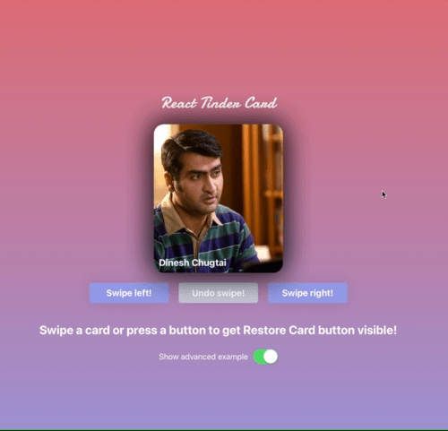

# React Tinder Card

A react component to make swipeable elements like in the app tinder.

## Compatibility
- React
- React Native

The installation, import and api is identical for both Web and Native.

## Demo


Try out the interactive demo <a href="https://3djakob.github.io/react-tinder-card-demo/">here.</a>

Check out the Web demo repo <a href="https://github.com/3DJakob/react-tinder-card-demo">here.</a>

Check out the Native demo repo <a href="https://github.com/3DJakob/react-native-tinder-card-demo">here.</a>

## Contributing
Want to contribute? Check out the [contributing.md](https://github.com/3DJakob/react-tinder-card/blob/master/CONTRIBUTING.md).

## Installation

```sh
npm install --save react-tinder-card
```

### React
If you are using React you will also need spring/web
```sh
npm install --save @react-spring/web@9.5.5
```

### React Native
If you are using React Native you will also need spring/native
```sh
npm install --save @react-spring/native@9.5.5
```

## Usage

Import TinderCard and use the component like the snippet. Note that the component will not remove itself after swipe. If you want that behaviour implement that on the `onCardLeftScreen` callback. It is recommended to have `overflow: hidden` on your `#root` to prevent cards from being visible after they go of screen.

```js
import TinderCard from 'react-tinder-card'

// ...

const onSwipe = (direction) => {
  console.log('You swiped: ' + direction)
}

const onCardLeftScreen = (myIdentifier) => {
  console.log(myIdentifier + ' left the screen')
}

return (
  <TinderCard onSwipe={onSwipe} onCardLeftScreen={() => onCardLeftScreen('fooBar')} preventSwipe={['right', 'left']}>Hello, World!</TinderCard>
)
```

If you want more usage help check out the demo repository code: [Web](https://github.com/3DJakob/react-tinder-card-demo/tree/master/src/examples) / [Native](https://github.com/3DJakob/react-native-tinder-card-demo/tree/master/src/examples)

The simple example is the minimum code needed to get you started.

The advanced example implements a state to dynamically remove swiped elements as well as using buttons to trigger swipes.

Both Web code examples can be tested on the [demo page.](https://3djakob.github.io/react-tinder-card-demo/) The Native code examples can be cloned and runned using `expo start`.

## Buttons inside a TinderCard

If you want a pressable element inside a TinderCard you will need to add  `className="pressable"` for it to work properly on mobile. This is because touchstart events are normally prevent defaulted to avoid scrolling the page when dragging cards around.

## Props

### `flickOnSwipe`

- optional
- type: `boolean`
- default: `true`

Whether or not to let the element be flicked away off-screen after a swipe.

### `onSwipe`

- optional
- type: `SwipeHandler`

Callback that will be executed when a swipe has been completed. It will be called with a single string denoting which direction the swipe was in: `'left'`, `'right'`, `'up'` or `'down'`.

### `onCardLeftScreen`

- optional
- type: `CardLeftScreenHandler`

Callback that will be executed when a `TinderCard` has left the screen. It will be called with a single string denoting which direction the swipe was in: `'left'`, `'right'`, `'up'` or `'down'`.

### `preventSwipe`

- optional
- type: `Array<string>`
- default: `[]`

An array of directions for which to prevent swiping out of screen. Valid arguments are `'left'`, `'right'`, `'up'` and `'down'`.

### `swipeRequirementType`

- optional
- type: `'velocity' | 'position'`
- default: `'velocity'`

What method to evaluate what direction to throw the card on release. 'velocity' will evaluate direction based on the direction of the swiping movement. 'position' will evaluate direction based on the position the card has on the screen like in the app tinder.
If set to position it is recommended to manually set swipeThreshold based on the screen size as not all devices will accommodate the default distance of 300px and the default native swipeThreshold is 1px which most likely is undesirably low.

### `swipeThreshold`

- optional
- type: `number`
- default: `300`

The threshold of which to accept swipes. If swipeRequirementType is set to velocity it is the velocity threshold and if set to position it is the position threshold.
On native the default value is 1 as the physics works differently there.
If swipeRequirementType is set to position it is recommended to set this based on the screen width so cards can be swiped on all screen sizes.

### `onSwipeRequirementFulfilled`

- optional
- type: `SwipeRequirementFufillUpdate`

Callback that will be executed when a `TinderCard` has fulfilled the requirement necessary to be swiped in a direction on release. This in combination with `onSwipeRequirementUnfulfilled` is useful for displaying user feedback on the card. When using this it is recommended to use `swipeRequirementType='position'` as this will fire a lot otherwise.
It will be called with a single string denoting which direction the user is swiping: `'left'`, `'right'`, `'up'` or `'down'`.

### `onSwipeRequirementUnfulfilled`

- optional
- type: `SwipeRequirementUnfufillUpdate`

Callback that will be executed when a `TinderCard` has unfulfilled the requirement necessary to be swiped in a direction on release.

### `className`

- optional
- type: `string`

HTML attribute class

### `children`

- optional
- type: `React.ReactNode`

The children passed in is what will be rendered as the actual Tinder-style card.

## API

### `swipe([dir])`

- `dir` (`Direction`, optional) - The direction in which the card should be swiped. One of: `'left'`, `'right'`, `'up'` and `'down'`.
- returns `Promise<void>`

Programmatically trigger a swipe of the card in one of the valid directions `'left'`, `'right'`, `'up'` and `'down'`. This function, `swipe`, can be called on a reference of the TinderCard instance. Check the [example](https://github.com/3DJakob/react-tinder-card-demo/blob/master/src/examples/Advanced.js) code for more details on how to use this.

### `restoreCard()`

- returns `Promise<void>`

Restore swiped-card state. Use this function if you want to undo a swiped-card (e.g. you have a back button that shows last swiped card or you have a reset button. The promise is resolved once the card is returned
